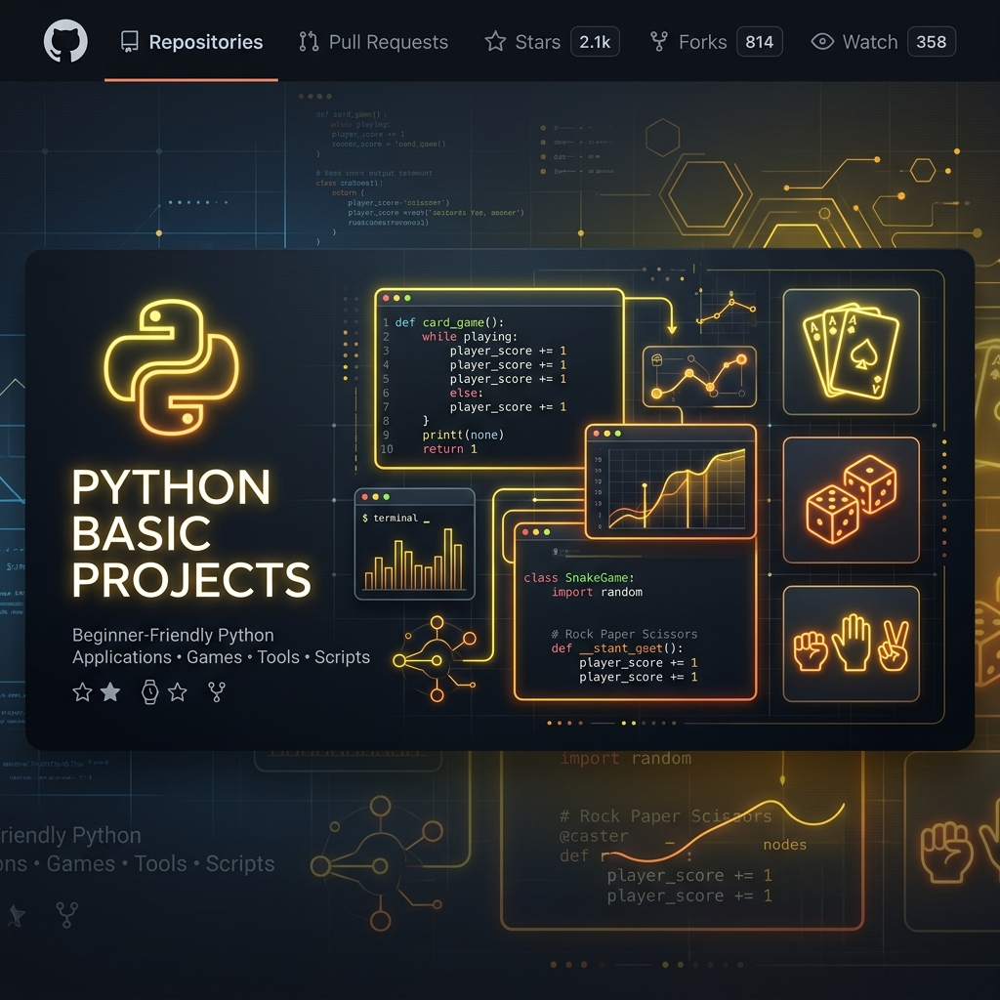
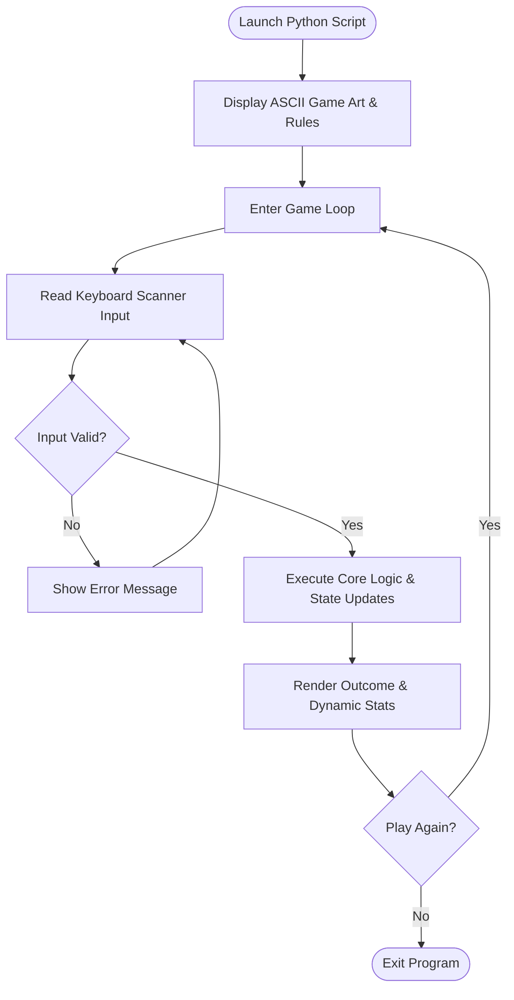

# 🐍 Python Basic Projects

[](https://www.python.org/)
[](https://docs.python.org/3/)
[](https://opensource.org/licenses/MIT)
[](https://makeapullrequest.com)

Welcome to the **Python Basic Projects** hub! This repository features a curated collection of beginner-friendly, console-driven Python applications and arcade games. Each project is built utilizing modular logic, core control flow structures, dictionary mappings, and ASCII terminal art to make learning Python visual, practical, and highly engaging.

---

<p align="center">
  
</p>

---

## 🗺️ Navigation Index

1. [✨ Project Showcase Catalog](#-project-showcase-catalog)
2. [🏗️ Application Flow Architecture](#%EF%B8%8F-application-flow-architecture)
3. [📁 Folder Structure Overview](#-folder-structure-overview)
4. [⚙️ How to Setup & Run Locally](#%EF%B8%8F-how-to-setup--run-locally)
5. [🤝 Contribution Guidelines](#-contributing)
6. [👥 Authors & Contact](#-authors)

---

## ✨ Project Showcase Catalog

Explore the list of interactive CLI applications included in this suite:

<details>
<summary>🎮 Interactive Games</summary>

- **🪨 Rock Paper Scissors:** Play against the computer with automated score counters and selection rules.
- **🃏 Blackjack (Black Jackson):** A complete terminal casino card game with double-down checks and dealer AI.
- **💀 Hangman Game:** A classic word-guessing game featuring dynamic ASCII hangman state art updates.
- **🔼 Higher Lower:** Guess which entity has more social media followers based on pre-compiled datasets.
- **🎯 Number Guessing Game:** Locate the hidden number within difficulty-bound limit counts.
- **🗺️ Treasure Hunt:** A text-driven choice adventure game with multiple branching logic paths.
</details>

<details>
<summary>🛠️ Utility Applications</summary>

- **🔏 Caesar Cipher (Ciser Cipher):** Secure encrypt and decrypt messages using alphabet shifting offsets.
- **🔑 Automatic Password Generator:** Instantly compile custom length passwords mixing letters, numbers, and symbols.
- **🧮 Dictionary-Based Calculator:** A mathematical calculator utilizing dictionary references to execute operations cleanly.
- **🏷️ Blind Auction:** Input bids anonymously in a local dictionary and calculate the highest bidder.
</details>

---

## 🏗️ Application Flow Architecture

All applications execute within a clean terminal game loop:



---

## 📁 Folder Structure Overview

```text
/
├── Automatic Password generator/    # Generates secure random keys
├── Black Jackson Project/            # Blackjack card simulation
├── Blind Auction Project/            # Secret bidding tracker
├── Calculator using Python Dictinary/# Math execution engine
├── Ciser Cipher Game/                # Text shifting cipher
├── Hangman Game/                     # Classic word guesser
├── Higher Lower game/                # Higher/lower metric game
├── Number Guessing Game/             # Binary guess boundaries
├── Rock Paper Scissor Game/          # Hand signal arcade
├── Treasure Hunt Game/               # Path choices adventure
├── assets/                           # Media resources
│   └── banner.png                    # Glow tech repository banner
└── README.md                         # Project hub directory (this file)
```

---

## ⚙️ How to Setup & Run Locally

### Prerequisites
- Install [Python 3.x](https://www.python.org/downloads/)

### Execution Steps
1. **Clone the repository:**
   ```bash
   git clone https://github.com/asad594/Python-Basic-Projects.git
   cd Python-Basic-Projects
   ```

2. **Navigate to your desired project directory:**
   ```bash
   # Example: entering the Blackjack game directory
   cd "Black Jackson Project"
   ```

3. **Launch the application:**
   ```bash
   python main.py
   ```

---

## 🤝 Contributing

Contributions, enhancements, and suggestions are always welcome!
Feel free to fork the repository, build new console-based games on a feature branch, and submit a Pull Request.

---

## 👥 Authors

Created and maintained with ❤️ by **Muhammad Asad** ([@asad594](https://github.com/asad594)).

---

⭐ *If you find these projects useful for practicing Python, don't forget to star the repository!*
